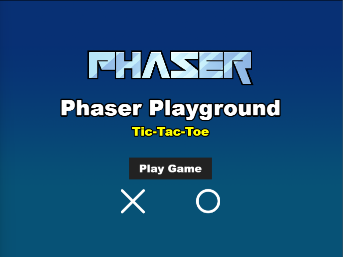
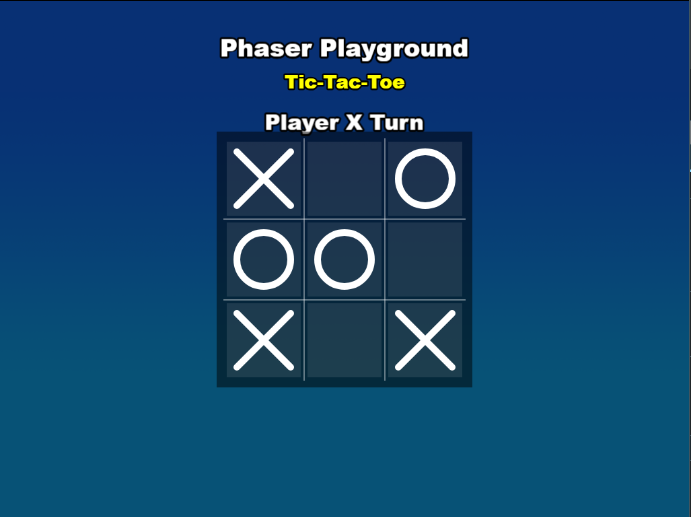

# Phaser Playground: Tic-Tac-Toe

This is a simple Tic-Tac-Toe game built with Phaser 3 as part of the Phaser Playground project. It features:

- Clean, responsive gameplay
- Visual celebrations for wins and draws
- Interactive menus and game over screens
- Handshake animation for draws and confetti for wins



### Versions

This template has been updated for:

- [Phaser 3.88.2](https://github.com/phaserjs/phaser)
- [Vite 5.3.1](https://github.com/vitejs/vite)



## Requirements

This project uses [Bun](https://bun.sh/) instead of npm for faster and more efficient package management. If you don't have Bun installed, you can install it with:

```bash
curl -fsSL https://bun.sh/install | bash
```

## Available Commands

| Command | Description |
|---------|-------------|
| `bun install` | Install project dependencies |
| `bun run dev` | Launch a development web server |
| `bun run build` | Create a production build in the `dist` folder |
| `bun run dev-nolog` | Launch a development web server without sending anonymous data |
| `bun run build-nolog` | Create a production build without sending anonymous data |


## Getting Started

After cloning the repo, run `bun install` from your project directory to install all dependencies. Then, start the local development server by running `bun run dev`.

The local development server runs on `http://localhost:8080` by default (you can see the exact URL in the terminal output). Your default browser should open automatically.

Once the server is running, you can play the game immediately:

1. Click "Play Game" on the main menu
2. Players take turns placing X's and O's on the 3x3 grid
3. First player to get three in a row (horizontally, vertically, or diagonally) wins
4. If all cells are filled with no winner, it's a draw

## Development

When you make changes to the game code in the `src` folder, Vite will automatically recompile and reload the browser. The main game logic is in `src/game/scenes/Game.js`.

## Template Project Structure

We have provided a default project structure to get you started. This is as follows:

| Path                         | Description                                                |
|------------------------------|------------------------------------------------------------|
| `index.html`                 | A basic HTML page to contain the game.                     |
| `public/assets`              | Game sprites, audio, etc. Served directly at runtime.      |
| `public/style.css`           | Global layout styles.                                      |
| `src/main.js`                | Application bootstrap.                                     |
| `src/game`                   | Folder containing the game code.                           |
| `src/game/main.js`           | Game entry point: configures and starts the game.          |
| `src/game/scenes`            | Folder with all Phaser game scenes.                        | 

## Project Structure

The game is organized into the following key files:

| File | Description |
|------|-------------|
| `src/game/main.js` | Game configuration and initialization |
| `src/game/scenes/Boot.js` | Initial loading scene |
| `src/game/scenes/Preloader.js` | Loads all game assets |
| `src/game/scenes/MainMenu.js` | Main menu with "Play Game" button |
| `src/game/scenes/Game.js` | The main game logic for Tic-Tac-Toe |
| `src/game/scenes/GameOver.js` | Game over screen with replay option |
| `public/assets/` | Game assets (images, SVGs) |

## Game Features

- **Clean visual design**: Simple but effective UI
- **Player turns**: X and O take turns placing their marks
- **Win detection**: Automatically detects wins in rows, columns, and diagonals
- **Draw detection**: Detects when the game ends in a draw
- **Animations**: 
  - Winning animations with confetti and highlighting the winning line
  - Draw animations with a handshake visual
- **Restart options**: Play again or return to main menu

## Handling Assets

Vite supports loading assets via JavaScript module `import` statements.

This template provides support for both embedding assets and also loading them from a static folder. To embed an asset, you can import it at the top of the JavaScript file you are using it in:

```js
import logoImg from './assets/logo.png'
```

To load static files such as audio files, videos, etc place them into the `public/assets` folder. Then you can use this path in the Loader calls within Phaser:

```js
preload ()
{
    //  This is an example of an imported bundled image.
    //  Remember to import it at the top of this file
    this.load.image('logo', logoImg);

    //  This is an example of loading a static image
    //  from the public/assets folder:
    this.load.image('background', 'assets/bg.png');
}
```

When you issue the `npm run build` command, all static assets are automatically copied to the `dist/assets` folder.

## Deploying to Production

After you run the `npm run build` command, your code will be built into a single bundle and saved to the `dist` folder, along with any other assets your project imported, or stored in the public assets folder.

In order to deploy your game, you will need to upload *all* of the contents of the `dist` folder to a public facing web server.

## Customizing the Template

### Vite

If you want to customize your build, such as adding plugin (i.e. for loading CSS or fonts), you can modify the `vite/config.*.mjs` file for cross-project changes, or you can modify and/or create new configuration files and target them in specific npm tasks inside of `package.json`. Please see the [Vite documentation](https://vitejs.dev/) for more information.

## Using Bun Instead of npm

This project has been configured to use [Bun](https://bun.sh/) instead of npm. Bun offers several advantages:

- **Speed**: Bun is significantly faster than npm for package installations and scripts
- **Modern JavaScript**: Better support for modern JS features
- **All-in-one tool**: Acts as a package manager, bundler, test runner, and more

### Migrating from npm to Bun

If you've used this template with npm before, you can easily switch to Bun:

1. Install Bun: `curl -fsSL https://bun.sh/install | bash`
2. Run `bun install` to generate a `bun.lock` file
3. Use `bun run [script-name]` instead of `npm run [script-name]`

All the scripts in package.json work the same way with Bun.

### Anonymous Usage Data Note

This template includes a `log.js` file that sends anonymous usage data to Phaser Studio. If you prefer not to send this data, use the `-nolog` commands:

```bash
bun run dev-nolog
```

or 

```bash
bun run build-nolog
```

## Building for Production

To create a production build:

```bash
bun run build
```

The optimized files will be output to the `dist` folder. These can be deployed to any static web server.

## Extending the Game

Some ideas for extending this Tic-Tac-Toe game:

- Add sounds for placing markers, winning, and draws
- Implement different themes or skins for the game board and markers
- Add a difficulty setting with AI opponents
- Create a score tracking system
- Add network multiplayer functionality

## Credits

This Tic-Tac-Toe game is built with [Phaser 3](https://phaser.io/), a powerful open-source framework for making HTML5 games.

### Phaser Community

If you're interested in game development with Phaser:

**Visit:** The [Phaser website](https://phaser.io) and follow on [Phaser Twitter](https://twitter.com/phaser_)<br />
**Learn:** [API Docs](https://newdocs.phaser.io), [Support Forum](https://phaser.discourse.group/)<br />
**Discord:** Join on [Discord](https://discord.gg/phaser)<br />
**Examples:** 2000+ [Code Examples](https://labs.phaser.io)<br />

## License

This Tic-Tac-Toe implementation is available under the MIT License. See the LICENSE file for more information.

The Phaser logo and characters are &copy; 2011 - 2025 Phaser Studio Inc.
